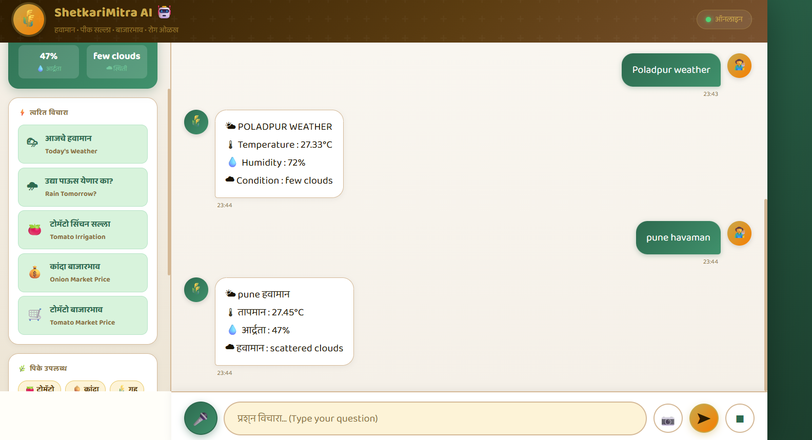
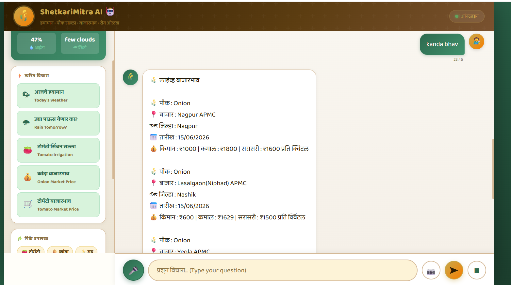
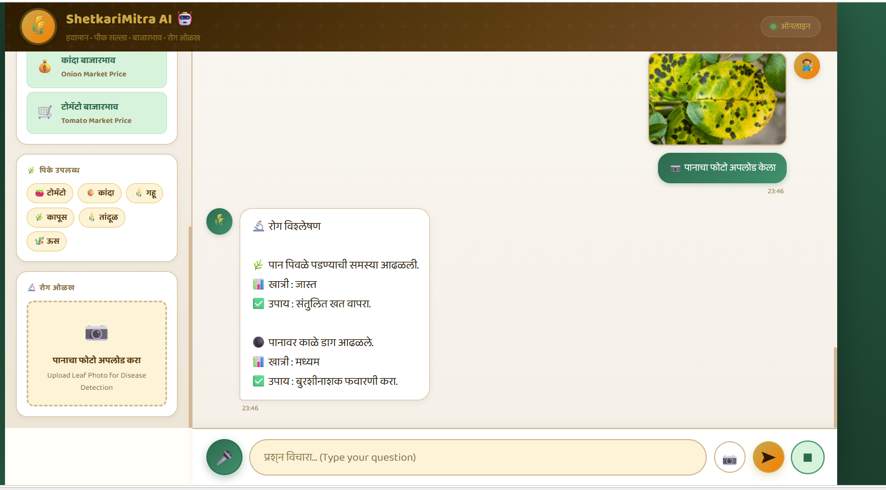

# 🌾 ShetkariMitra AI

An AI-powered farming assistant designed to help farmers with weather updates, crop advice, disease detection, and market prices.

## Features

* 🤖 AI-powered farming assistance using Groq (LLaMA 3.3)
* 🌦 Live weather updates
* 💰 Live mandi (market) prices
* 📸 Crop disease detection using OpenCV
* 🎤 Voice input support
* 🌐 Marathi and English language support
* 🗄 SQLite-based knowledge base

## Tech Stack

* Python
* Flask
* OpenCV
* SQLite
* HTML
* CSS
* JavaScript
* Groq API
* OpenWeatherMap API
* Data.gov.in API

## Future Improvements

* Personalized crop recommendations
* Better disease detection accuracy
* More market integrations
* Mobile application support

## Author

Ankita Varat
BE Information Technology (2025)

## Screenshots

### Main UI

### Weather Feature

### Live Market Prices

### Disease Detection

