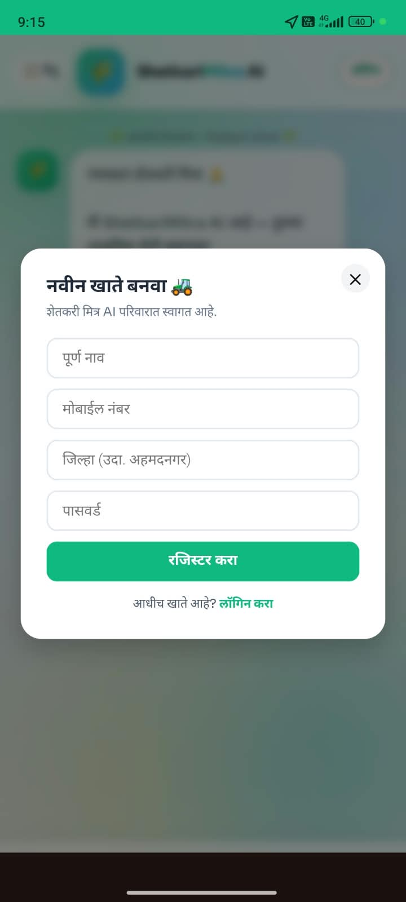
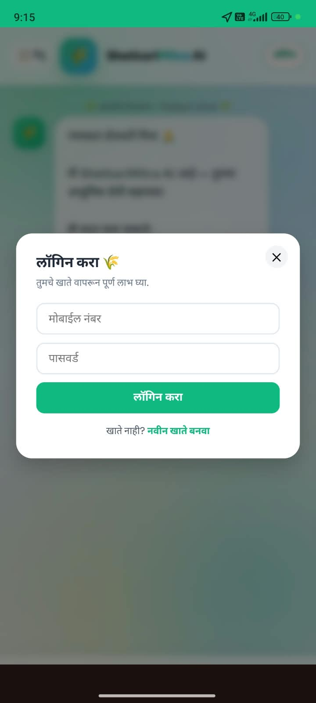
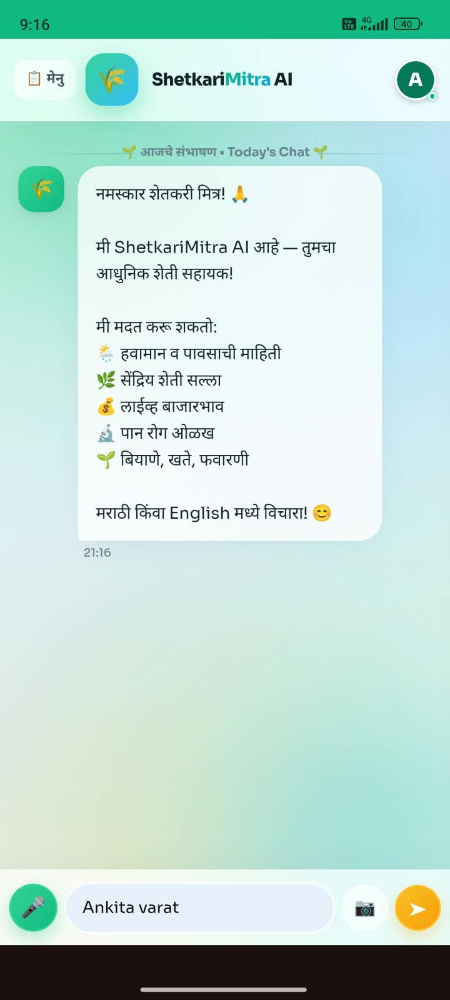
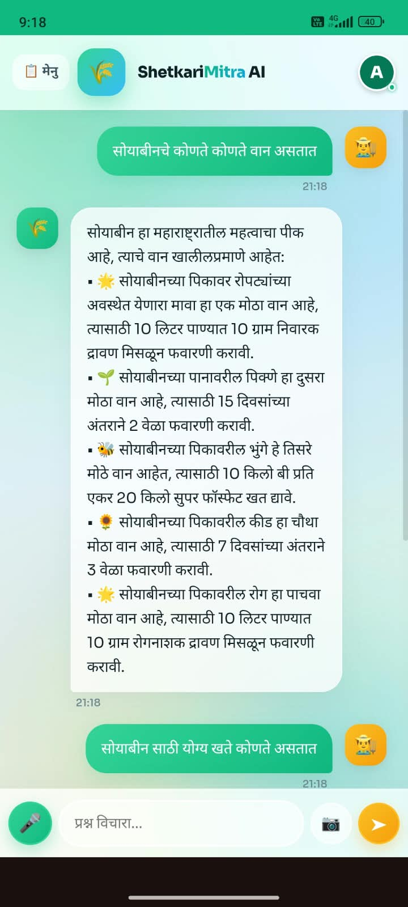
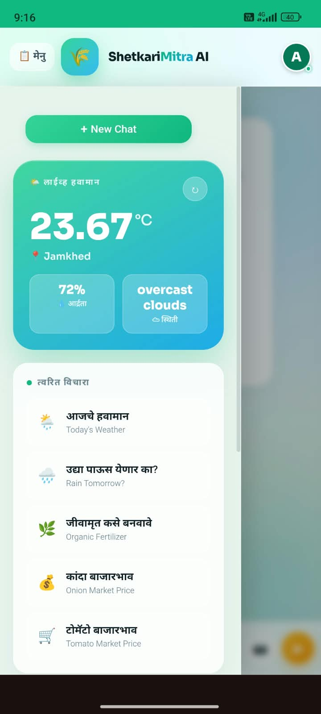
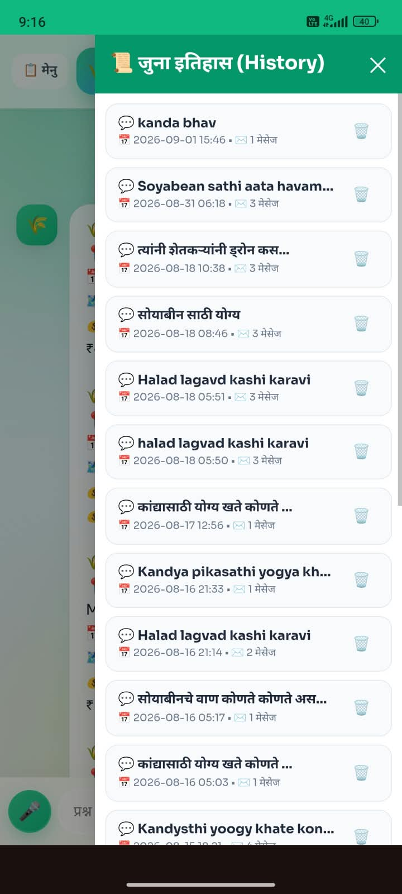
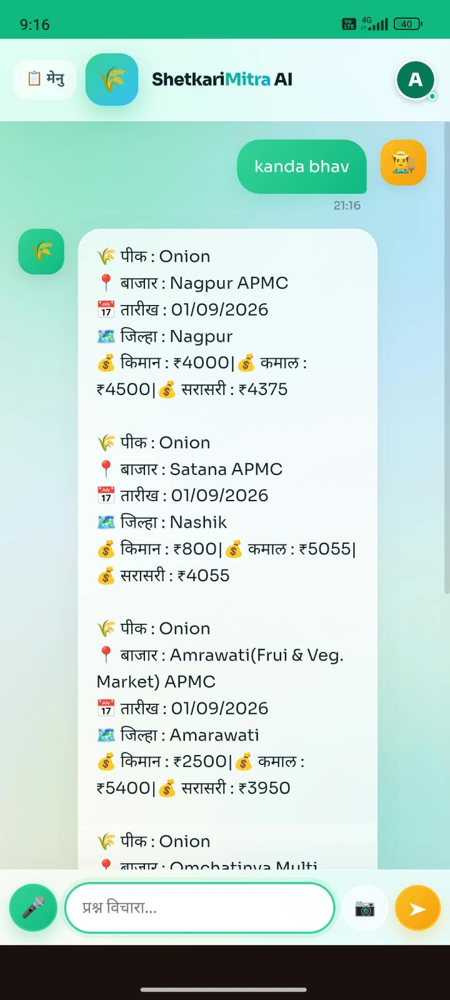
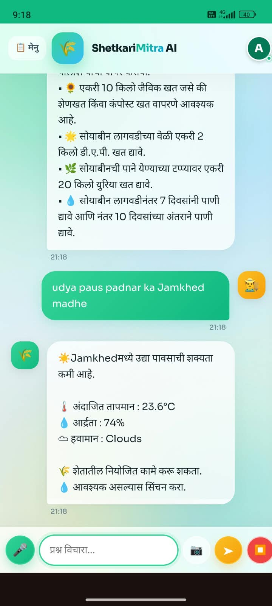
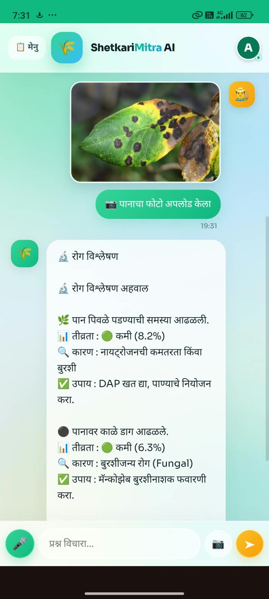

# 🌾 ShetkariMitra AI

### AI-Powered Bilingual Farming Assistant

ShetkariMitra AI is an AI-powered farming assistant designed to help farmers access useful agricultural information through a simple and user-friendly interface.

The application supports **Marathi and English** and provides assistance related to weather, crops, farming practices, crop diseases, and other agriculture-related queries.

---

## 🚀 Features

### 🤖 AI Farming Assistant

- AI-powered conversational assistant for farming-related queries
- Provides useful and practical farming information
- Supports Marathi and English conversations

### 🔐 User Registration & Login

- User registration functionality
- User login functionality
- User authentication using Supabase
- User-specific application experience

### 🗄️ Supabase & PostgreSQL

- Supabase integrated with PostgreSQL
- Persistent storage for application data
- User-related data management
- Database-backed chat history

### 💬 Chat History

- Automatically stores user conversations
- Users can view their previous conversations
- Each conversation is displayed separately
- Chat history remains available after the session

### 🗑️ Delete Chat

- Users can delete individual conversations
- Delete option is available directly in the Chat History panel
- Makes conversation management easier

### 🌦️ Weather Information

- Current weather information
- Rain-related information
- Weather-based farming assistance
- Location-based weather support

### 🌱 Crop Guidance

- Crop-related farming advice
- Planting guidance
- Water-related recommendations
- Organic farming guidance

### 🦠 Crop Disease Detection

- Image-based crop analysis
- Crop disease detection using OpenCV
- Helps identify possible crop-related problems

### 🗣️ Bilingual Support

- Marathi language support
- English language support
- Designed to make agricultural information easier to access

### 📱 Responsive User Interface

- Simple and user-friendly interface
- Designed for desktop and mobile screens
- Farmer-focused UI

---

## 🛠️ Tech Stack

### Frontend

- HTML
- CSS
- JavaScript

### Backend

- Python
- Flask

### Database & Authentication

- Supabase
- PostgreSQL
- SQLite

### AI & Computer Vision

- AI / LLM
- OpenCV

### APIs

- REST APIs
- Weather API
- Agricultural market data API

### PWA

- Progressive Web App (PWA)
- Web App Manifest
- Service Worker

---

## 🏗️ Application Flow

```text
User
 ↓
Register / Login
 ↓
Authentication
 ↓
ShetkariMitra AI
 ↓
Ask a Farming-related Question
 ↓
AI / Application Processing
 ↓
Response
 ↓
Conversation Stored in Database
 ↓
Chat History
 ↓
View / Delete Individual Chats
```

---

## 📱 Progressive Web App (PWA)

ShetkariMitra AI is built as a **Progressive Web App (PWA)**, providing an app-like experience on supported devices.

- 📲 Installable on mobile and desktop
- 📱 Responsive and mobile-friendly interface
- ⚡ App-like user experience
- 🌐 Accessible through the web

---

## 🗄️ Authentication & Database

ShetkariMitra AI uses **Supabase with PostgreSQL** for user authentication and persistent data storage.

### 🔐 Authentication
- User registration
- User login
- User authentication using Supabase
- User-specific account access

### 💾 Database
PostgreSQL is used to store and manage application data, including:
- User-related data
- Chat conversations
- Persistent chat history
- User-specific conversation records

### 💬 Chat History Management
- Conversations are stored in the database
- Users can access their previous conversations
- Each user's conversations are associated with their account
- Users can delete individual conversations from their chat history

---

## 🌾 What ShetkariMitra AI Can Help With

- 🌦️ Weather information
- 🌧️ Rain-related information
- 🌱 Crop guidance
- 🌿 Organic farming
- 💧 Water-related advice
- 🦠 Crop disease detection
- 💬 Farming-related questions
- 🗣️ Marathi and English interaction

---

## 📸 Application Screenshots

### 🔐 Registration


### 📝 Login


### 🏠 Main Dashboard


### 🤖 AI Chat


### 🤖 Menu


### 💬 Chat History


### 💬 Live Market


### 🌦️ Weather Information


### 🦠 Crop Disease Detection


---

## 🔄 Project Development Journey

The project has evolved through multiple stages:

```text
Idea
 ↓
Basic AI Assistant
 ↓
Farming Features
 ↓
Weather Integration
 ↓
Crop Guidance
 ↓
Crop Disease Detection
 ↓
Marathi + English Support
 ↓
User Registration & Login
 ↓
Supabase + PostgreSQL Integration
 ↓
Persistent Chat History
 ↓
Individual Chat Deletion
 ↓
Continuous Improvements 🚀
```
---

## 🎯 Future Improvements

- 🦠 Improve crop disease detection accuracy
- 🌾 Add more crop-specific agricultural guidance
- 🤖 Improve AI responses for farming-related queries
- 🌐 Add support for more regional languages
- 👤 Improve personalized recommendations for farmers
- 📱 Further improve the mobile and PWA experience
- 💰 Enhance agricultural market price information
- 🌦️ Add more advanced weather and farming insights
- 🔔 Add useful notifications and farming alerts
- 🚜 Add more practical farmer-focused features

---

## 👩‍💻 Developer

**Ankita Varat**  
**B.E. Information Technology**

### 🌱 Project Vision

ShetkariMitra AI aims to use **Artificial Intelligence and technology to make useful agricultural information more accessible, simple, and practical for farmers.**

---

⭐ If you find this project interesting, consider giving it a star on GitHub.
